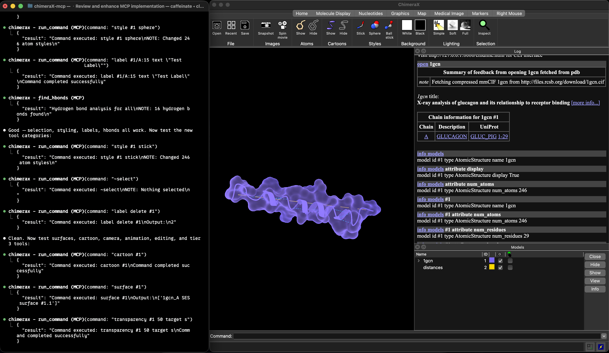

# ChimeraX MCP Server



A standalone [Model Context Protocol](https://modelcontextprotocol.io) (MCP) server that connects AI coding assistants to [UCSF ChimeraX](https://www.cgl.ucsf.edu/chimerax/) for molecular visualization and structural biology workflows.

## About

ChimeraX MCP bridges the gap between conversational AI and molecular visualization. Instead of manually typing ChimeraX commands, you describe what you want in natural language — open structures, run analyses, generate publication figures — and the MCP server translates your intent into precise ChimeraX operations via its REST API.

The server handles everything automatically: discovering or launching ChimeraX instances, managing sessions across multiple ports, formatting results, and providing contextual error hints when something goes wrong.

**Key capabilities:**
- **119 specialized tools** covering the full structural biology workflow
- **Auto-launch** — ChimeraX starts automatically when needed, no manual setup
- **Multi-session** — work with multiple ChimeraX instances simultaneously
- **Input validation** — atomspec validation and error hints for common mistakes
- **Configurable** — environment variables for ports, paths, timeouts, and debug logging

```
AI Assistant  -->  MCP (stdio)  -->  chimerax-mcp (Python)  -->  HTTP REST  -->  ChimeraX
```

Inspired by the [RBVI official ChimeraX MCP bridge](https://github.com/RBVI/ChimeraX/tree/develop/src/bundles/mcp_server).

## Prerequisites

- [UCSF ChimeraX](https://www.cgl.ucsf.edu/chimerax/download.html) installed
- Python 3.11+
- A local MCP client such as Claude Code, Claude Desktop, Codex, Cursor, VS Code, Gemini CLI, or similar

## Quick Install (Codex Desktop, Codex CLI, and more)

```bash
git clone https://github.com/BenWertoski/chimeraX-mcp.git
cd chimeraX-mcp
./install.sh
```

That's it. The script creates a Python venv in `.venv/`, installs the package, writes the MCP config for Codex (shared by **Codex Desktop** and the **Codex CLI** via `~/.codex/config.toml`), and runs a `doctor` check.

**After the script finishes, fully quit Codex Desktop (⌘Q — not just closing the window) and reopen it.** The ChimeraX tools will appear on the next launch.

Install for a different client instead:

```bash
./install.sh claude-desktop
./install.sh cursor
./install.sh claude-code
./install.sh copilot
./install.sh gemini
./install.sh cline
./install.sh continue
./install.sh windsurf
```

> **Windows users:** `install.sh` is bash-only. Follow the [Manual Installation](#manual-installation) steps below in PowerShell.

### Manual Installation

If you'd rather drive each step yourself or you're developing the server:

```bash
git clone https://github.com/BenWertoski/chimeraX-mcp.git
cd chimeraX-mcp
python3 -m venv .venv && source .venv/bin/activate
pip install .                    # or `pip install -e ".[dev]"` for development
chimerax-mcp setup codex         # or any other client name
```

## Commands

Once installed, these commands are available inside the venv (or via `./.venv/bin/chimerax-mcp`):

```bash
chimerax-mcp doctor                       # inspect environment + ChimeraX availability
chimerax-mcp list-clients                 # list supported local clients
chimerax-mcp print-config codex           # preview a config snippet without writing
chimerax-mcp setup codex                  # write/update a client's MCP config
chimerax-mcp serve                        # run the MCP server (used by clients)
chimerax-mcp serve --profile core         # lighter tool profile (~45 tools)
```

## Platform Support

This repository currently ships a **local stdio MCP server**. In practice, that means it works best with AI clients that can launch a local command on the user's machine.

| Platform | Connection Model | Status | Notes |
|----------|------------------|--------|-------|
| Claude Code CLI | Local stdio MCP | Supported today | Best local setup path for Anthropic users |
| Claude Desktop | Local MCP server | Supported today | Works with local server config; desktop extension packaging is not included yet |
| OpenAI Codex Desktop (`Codex.app`) | Local stdio MCP | Supported today | Shares `~/.codex/config.toml` with the Codex CLI and IDE extension |
| OpenAI Codex CLI | Local stdio MCP | Supported today | Config is shared with Codex Desktop and the IDE extension |
| OpenAI Codex IDE extension | Local stdio MCP | Supported today | Uses the same `~/.codex/config.toml` as the CLI / desktop app |
| Cursor | Local stdio MCP | Supported today | Project-scoped or global config |
| GitHub Copilot in VS Code | Local stdio MCP | Supported today | Tools appear in Agent mode |
| Windsurf | Local stdio MCP | Supported with caveat | Windsurf has a 100-tool limit across all MCP servers; use the `core` profile |
| Cline | Local stdio MCP | Supported today | Local config file |
| Continue.dev | Local stdio MCP | Supported today | Agent mode only |
| Gemini CLI | Local stdio MCP | Supported today | Local config file |
| ChatGPT / ChatGPT Desktop | Remote MCP connector/app | Not supported by this repo alone | Requires a hosted remote MCP server, plus auth and possibly a local bridge if you want to control a local ChimeraX app |
| Claude web / mobile remote connectors | Remote MCP connector | Not supported by this repo alone | Requires a hosted remote MCP server rather than a locally launched command |

## Setup

Choose the setup path that matches your client. The sections below are for platforms that can launch this repository as a **local MCP server**.

For clients with configurable MCP timeouts, use **at least 600 seconds** to cover long-running tools such as structure prediction, Modeller, and Boltz.

For a first-time install, `./install.sh <client-name>` handles everything in one step (see [Quick Install](#quick-install-codex-desktop-codex-cli-and-more)). To add another client after you've already installed once, or to re-sync the config, use:

```bash
chimerax-mcp setup <client-name>
```

Use `chimerax-mcp print-config <client-name>` to review the generated snippet first, and pass `--path` if your config lives somewhere nonstandard.

<details>
<summary><b>Claude Code CLI</b></summary>

```bash
claude mcp add chimerax -- /path/to/chimeraX-mcp/.venv/bin/python -m chimerax_mcp serve
```
</details>

<details>
<summary><b>Claude Desktop</b></summary>

Edit `~/Library/Application Support/Claude/claude_desktop_config.json` (macOS) or `%APPDATA%\Claude\claude_desktop_config.json` (Windows):

```json
{
  "mcpServers": {
    "chimerax": {
      "command": "/path/to/chimeraX-mcp/.venv/bin/python",
      "args": ["-m", "chimerax_mcp", "serve"]
    }
  }
}
```

Restart Claude Desktop after editing.
</details>

<details>
<summary><b>Cursor</b></summary>

Create `~/.cursor/mcp.json` (global) or `.cursor/mcp.json` (project):

```json
{
  "mcpServers": {
    "chimerax": {
      "command": "/path/to/chimeraX-mcp/.venv/bin/python",
      "args": ["-m", "chimerax_mcp", "serve"]
    }
  }
}
```

Restart Cursor after editing.
</details>

<details>
<summary><b>GitHub Copilot (VS Code)</b></summary>

Create `~/.config/Code/User/mcp.json` (global) or `.vscode/mcp.json` (project):

```json
{
  "servers": {
    "chimerax": {
      "type": "stdio",
      "command": "/path/to/chimeraX-mcp/.venv/bin/python",
      "args": ["-m", "chimerax_mcp", "serve"]
    }
  }
}
```

> **Note:** Copilot uses `"servers"`, not `"mcpServers"`. Tools only appear in **Agent mode**.
</details>

<details>
<summary><b>Windsurf</b></summary>

Edit `~/.codeium/windsurf/mcp_config.json`:

```json
{
  "mcpServers": {
    "chimerax": {
      "command": "/path/to/chimeraX-mcp/.venv/bin/python",
      "args": ["-m", "chimerax_mcp", "serve", "--profile", "core"]
    }
  }
}
```

> **Note:** Windsurf has a 100-tool limit across all MCP servers. Tools only work in Cascade mode.
</details>

<details>
<summary><b>Cline (VS Code)</b></summary>

Open Cline panel > MCP Servers icon > "Configure MCP Servers", or edit directly:

```json
{
  "mcpServers": {
    "chimerax": {
      "command": "/path/to/chimeraX-mcp/.venv/bin/python",
      "args": ["-m", "chimerax_mcp", "serve"],
      "disabled": false
    }
  }
}
```
</details>

<details>
<summary><b>OpenAI Codex (Desktop app, CLI, and IDE extension)</b></summary>

The easiest path is `./install.sh` (see [Quick Install](#quick-install-codex-desktop-codex-cli-and-more) above) — it writes the config block below for you.

If you'd rather edit the file by hand, open `~/.codex/config.toml` (note: TOML format, not JSON) and append:

```toml
[mcp_servers.chimerax]
command = "/path/to/chimeraX-mcp/.venv/bin/python"
args = ["-m", "chimerax_mcp", "serve"]
enabled = true
tool_timeout_sec = 600
```

The Codex Desktop app (`Codex.app`), the Codex CLI, and the Codex IDE extension all read this same file, so one entry covers all three. Fully quit and reopen the Codex app (⌘Q) after editing.
</details>

<details>
<summary><b>Gemini CLI</b></summary>

Edit `~/.gemini/settings.json`:

```json
{
  "mcpServers": {
    "chimerax": {
      "command": "/path/to/chimeraX-mcp/.venv/bin/python",
      "args": ["-m", "chimerax_mcp", "serve"],
      "timeout": 600000
    }
  }
}
```

> **Note:** Gemini timeout is in **milliseconds**.
</details>

<details>
<summary><b>Continue.dev</b></summary>

Add to `~/.continue/config.yaml`:

```yaml
mcpServers:
  - name: chimerax
    command: /path/to/chimeraX-mcp/.venv/bin/python
    args:
      - -m
      - chimerax_mcp
      - serve
```

Tools only available in **Agent mode**.
</details>

<details>
<summary><b>ChatGPT / ChatGPT Desktop</b></summary>

ChatGPT custom connectors and apps use **remote MCP**, not a locally launched stdio command. This repository does **not** currently ship a hosted remote MCP service, so there is no direct ChatGPT install path yet.

To support ChatGPT in the future, this project would need:

- A hosted remote MCP endpoint
- Authentication/OAuth as needed by the target surface
- Optionally, a local bridge/companion app if remote ChatGPT should control a user's local ChimeraX GUI session

If your goal is to use ChimeraX from ChatGPT today, this repository by itself is not enough.
</details>

<details>
<summary><b>Claude Remote Connectors (claude.ai / mobile)</b></summary>

Claude's remote connector surfaces also use **remote MCP**, not a local stdio command. This repository currently targets local MCP clients such as Claude Code and Claude Desktop.

If you want Claude web or mobile support in the future, you would need to deploy a hosted remote MCP server for this project.
</details>

Replace `/path/to/chimeraX-mcp` with your actual install path. ChimeraX auto-launches when you first use a tool in supported local clients.

## Configuration

| Environment Variable | Default | Description |
|---------------------|---------|-------------|
| `CHIMERAX_PORT` | `8080` | Default ChimeraX REST server port |
| `CHIMERAX_PATH` | auto-detect | Path to ChimeraX executable |
| `CHIMERAX_TIMEOUT` | `60` | Default command timeout (seconds) |
| `CHIMERAX_DEBUG` | `false` | Enable debug logging (`1`, `true`, or `yes`) |

## Available Tools (119)

### Core (2)

| Tool | Description |
|------|-------------|
| `run_command` | Execute any ChimeraX command directly |
| `get_atomspec_guide` | Reference guide for atom specification syntax |

### Structure Management (5)

| Tool | Description |
|------|-------------|
| `open_structure` | Open PDB/mmCIF files or fetch from PDB/EMDB databases |
| `close_models` | Remove models from session |
| `list_models` | List all loaded models with display status and atom counts |
| `get_model_info` | Detailed model information including chains, atoms, bonds |
| `get_chain_info` | Chain-level details with sequence and residue info |

### Display & Styling (8)

| Tool | Description |
|------|-------------|
| `show_hide_objects` | Control visibility of atoms, bonds, cartoons, surfaces, models |
| `color_models` | Color structures and selections by any ChimeraX color |
| `set_style` | Change atomic display style (stick, ball-and-stick, sphere) |
| `set_cartoon` | Control cartoon/ribbon display and style (rounded, edged, piping) |
| `set_size` | Change display sizes for atoms, sticks, and balls |
| `set_transparency` | Set transparency on surfaces, cartoons, or atoms |
| `get_shown` | Query current visibility state of all models |
| `apply_preset` | Apply built-in visualization presets (publication, interactive, etc.) |

### Camera & View (6)

| Tool | Description |
|------|-------------|
| `set_scene` | Configure background color, lighting, silhouettes, camera mode |
| `set_camera` | Control camera mode (mono, orthographic, stereo, 360) and FOV |
| `set_lighting` | Control lighting environment and shadows |
| `set_clipping` | Slice through structures with near/far/slab clipping planes |
| `zoom_view` | Zoom in/out by factor or exact pixel size |
| `view_residue` | Center view and rotation on a specific residue |

### Analysis & Measurement (13)

| Tool | Description |
|------|-------------|
| `measure_distance` | Measure distance between two atoms |
| `measure_angle` | Measure angle between three atoms |
| `measure_torsion` | Measure torsion/dihedral angle between four atoms |
| `measure_sasa` | Calculate solvent-accessible surface area |
| `measure_center` | Calculate geometric center of a selection |
| `measure_buried_area` | Buried surface area between two groups of atoms |
| `calculate_rmsd` | Calculate RMSD between two sets of atoms |
| `find_hbonds` | Hydrogen bond detection and analysis |
| `find_clashes` | Steric clash detection with configurable overlap cutoff |
| `find_cavities` | Detect binding pockets and cavities (KVFinder) |
| `show_contacts` | Find and display protein-protein interfaces |
| `align_structures` | Structural alignment via matchmaker (reports RMSD) |
| `define_axis_plane` | Define geometric axis, plane, or centroid for atoms |

### Selection (3)

| Tool | Description |
|------|-------------|
| `select_atoms` | Select atoms/residues/chains with set, add, subtract, or clear modes |
| `select_zone` | Select everything within a distance of a target (zone selection) |
| `name_selection` | Create named selections for reuse in other commands |

### Labels & Annotations (4)

| Tool | Description |
|------|-------------|
| `label_atoms` | Add/remove 3D text labels on atoms or residues |
| `label_2d` | Add 2D text overlays on the viewport (titles, annotations) |
| `add_scalebar` | Add/remove distance scale bar for publication figures |
| `color_key` | Add/remove color key (legend) for coloring schemes |

### Surfaces & Volumes (7)

| Tool | Description |
|------|-------------|
| `create_surface` | Generate molecular surfaces (solid, mesh, or dot styles) |
| `color_surface` | Color surfaces by electrostatics, hydrophobicity, or B-factor |
| `set_volume_display` | Control density map contour level, style, step, and color |
| `atoms_to_map` | Generate simulated density map from atomic coordinates |
| `fit_in_map` | Fit an atomic model into an electron density map |
| `measure_surface_area` | Measure area of a molecular surface |
| `measure_map_stats` | Get density map statistics (mean, RMS, min, max) |

### Sequence & Search (4)

| Tool | Description |
|------|-------------|
| `get_sequence` | Get chain sequence in FASTA format |
| `blast_search` | Run BLAST sequence search against PDB or other databases |
| `foldseek_search` | Find structurally similar proteins via Foldseek |
| `similar_structures` | Find similar PDB entries via Similar Structures tool |

### Structure Editing (10)

| Tool | Description |
|------|-------------|
| `swap_residue` | Mutate a residue to a different amino acid |
| `swap_nucleic_acid` | Mutate a nucleic acid residue to a different base |
| `add_hydrogens` | Add hydrogen atoms to a structure |
| `add_charges` | Add partial charges (for electrostatics) |
| `minimize_structure` | Energy minimize a structure (configurable steps, 5-min timeout) |
| `delete_atoms` | Delete atoms, residues, or solvent from a model |
| `manage_bonds` | Add or remove bonds between atoms |
| `change_chain_ids` | Change chain ID(s) for a selection |
| `renumber_residues` | Renumber residues starting from a given number |
| `build_structure` | Build atoms, peptides, or nucleic acids from scratch |

### Model Operations (5)

| Tool | Description |
|------|-------------|
| `split_model` | Split a model into sub-models by chains, ligands, etc. |
| `combine_models` | Merge multiple models into one |
| `copy_model` | Create a copy of a model |
| `rename_model` | Rename a model |
| `tile_models` | Arrange models side-by-side in a grid layout |

### Prediction & Structure Search (2)

| Tool | Description |
|------|-------------|
| `predict_structure` | AlphaFold or ESMFold structure prediction from sequence |
| `prep_for_docking` | Prepare structure for docking (adds H, charges, repairs) |

### Symmetry & Crystallography (2)

| Tool | Description |
|------|-------------|
| `show_symmetry` | Show biological assembly or crystallographic symmetry copies |
| `show_crystal_contacts` | Show crystal packing contacts and neighbors |

### Animation & Movies (3)

| Tool | Description |
|------|-------------|
| `rotate_view` | Rotate or rock the view around an axis |
| `move_model` | Translate models or camera along an axis |
| `record_movie` | Record, stop, and encode movies (H.264, VP8, GIF, APNG) |

### Scene & Session Management (10)

| Tool | Description |
|------|-------------|
| `save_session` | Save current session to a .cxs file |
| `open_session` | Restore a previously saved session |
| `manage_scenes` | Save, restore, list, or delete named viewpoints |
| `get_session_info` | Full session overview (models, visibility, status) |
| `list_chimerax_instances` | List all running ChimeraX instances |
| `start_new_chimerax_session` | Launch a new ChimeraX instance |
| `check_chimerax_status` | Health check on a specific session |
| `set_default_session` | Change which session receives commands by default |
| `set_window_size` | Set the viewport window dimensions |
| `save_image` | Save publication-quality screenshots |

### Rendering & Materials (2)

| Tool | Description |
|------|-------------|
| `set_material` | Control surface reflectivity and shininess |
| `add_shape` | Add geometric shapes (sphere, cylinder, arrow) to the scene |

### Specialized (7)

| Tool | Description |
|------|-------------|
| `show_nucleotides` | Display RNA/DNA base representations (ladder, slab, tube) |
| `assign_secondary_structure` | Recalculate secondary structure (DSSP) |
| `morph_structures` | Animate between structural conformations |
| `coordset` | Navigate NMR ensembles and MD trajectories |
| `altlocs` | Show or change alternate conformations |
| `set_attribute` | Set custom attributes on atoms/residues/models |
| `show_crosslinks` | Visualize crosslinking mass spectrometry data |

### Markers & 3D Printing (3)

| Tool | Description |
|------|-------------|
| `add_marker` | Place 3D markers/spheres at specific coordinates |
| `struts` | Add/remove struts for 3D printing support |
| `undo_redo` | Undo or redo recent actions |

### Crystallography & Virology (3)

| Tool | Description |
|------|-------------|
| `show_aniso` | Show/hide thermal ellipsoids (anisotropic displacement) |
| `show_hkcage` | Display icosahedral cage for virus capsid analysis |
| `check_chirality` | Check and report chirality of residues |

### Validation & Scoring (3)

| Tool | Description |
|------|-------------|
| `residue_fit_density` | Per-residue density fit scores for model validation |
| `show_mutation_scores` | Display mutation fitness/conservation scores |
| `show_bumps` | Show/hide steric bump indicators |

### Homology & Prediction (2)

| Tool | Description |
|------|-------------|
| `run_modeller` | Run Modeller for homology modeling or loop refinement |
| `predict_boltz` | Boltz structure prediction |

### RNA-Specific (1)

| Tool | Description |
|------|-------------|
| `show_rna` | RNA-specific visualization (ladder, slab, tube, backbone) |

### Camera Animation (4)

| Tool | Description |
|------|-------------|
| `fly_camera` | Smooth camera fly-through to positions |
| `roll_view` | Continuous spin rotation around an axis |
| `wobble_view` | Oscillating rotation for depth perception |
| `crossfade` | Smooth visual crossfade transition for movies |

### Data & Attributes (4)

| Tool | Description |
|------|-------------|
| `get_coordinates` | Get XYZ coordinates for atoms |
| `load_attributes` | Load custom attributes from file (.defattr) |
| `manage_pseudobonds` | Style or hide pseudobonds (H-bonds, crosslinks, etc.) |
| `manage_log` | Control the ChimeraX log panel (show, clear, save) |

### Graphics & Rendering (2)

| Tool | Description |
|------|-------------|
| `set_graphics` | Control rendering quality and frame rate |
| `show_topography` | Create height-field surface from volume data |

### Automation (1)

| Tool | Description |
|------|-------------|
| `create_alias` | Create, list, or delete command aliases (macros) |

### Map Series (1)

| Tool | Description |
|------|-------------|
| `play_map_series` | Play through density map series (time-resolved data) |

### Documentation (2)

| Tool | Description |
|------|-------------|
| `list_chimerax_commands` | Browse all available ChimeraX commands |
| `get_command_documentation` | Get detailed documentation for any ChimeraX command |

## Usage Examples

Once configured, just ask Claude naturally:

```
"Open PDB structure 1GCN and show it as ribbons colored by chain"

"Find all hydrogen bonds in chain A"

"Measure the distance between residue 100 CA and residue 200 CA"

"Create a surface for the protein and color it by electrostatic potential"

"Select everything within 5 Angstroms of the ligand and label those residues"

"Save a publication-quality image with white background at 4K resolution"

"Record a 360-degree rotation movie of the structure"

"Find proteins with similar structure using Foldseek"

"Show the biological assembly for this crystal structure"

"Prepare this structure for docking"

"Predict the structure of this sequence: MKTLLILAVL..."

"Split the model by chains and tile them side-by-side"
```

## Development

```bash
# Setup
python -m venv .venv && source .venv/bin/activate
pip install -e ".[dev]"

# Run tests (216 tests)
.venv/bin/pytest tests/ -v

# Enable debug logging
CHIMERAX_DEBUG=true .venv/bin/python -m chimerax_mcp
```

## Architecture

| Module | Role |
|--------|------|
| `server.py` | FastMCP instance, all 119 tool definitions, entry point |
| `chimera_rest.py` | REST client, auto-launch, instance discovery, session management |
| `formatting.py` | Response formatting, error hints, input validation |
| `docs.py` | Atomspec guide, ChimeraX command documentation (HTML to markdown) |

## License

MIT
